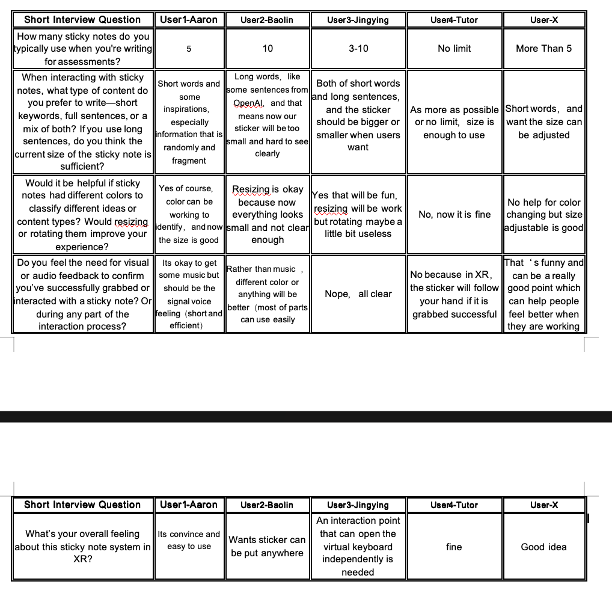

# Evaluation 1 Documentation

Evaluation 1 results& analysis；Feedback figure；My plan

Results & Analysis

The focus of this round of testing was to check if users can understand and
operate the sticky note function and the paper function smoothly. The plan
focused on three aspects. First, to confirm if users can intuitively understand the grab and drag interaction, and if this interaction fits their expectation and logic of this space. Second, to confirm the usability of current functions, and if they can finish text input clearly and directly. Finally, to confirm how users imagine managing content in this space. Based on this, I designed a set of short questions to help organise the testing results, and focused the questions on suggestions strongly related to user experience, in order to capture deeper feedback about usability and functions. Feedback Analysis In this test feedback session (reference-image1), user feedback about Inkroom prototype was mainly in three areas: the information capacity of sticky notes,
the feedback mechanism of interaction, and the flexibility of space
management. First, in terms of information capacity, users showed different needs. This led
to expectations about sticky note size. Some feedback pointed out that the
current sticky note is too small to support long sentence reading, and
suggested adding a size adjustment function to fit different writing habits. At
the same time, in space management and functions, users showed a demand
for freedom. Specifically, they mentioned the position of sticky notes (free
placement anywhere in the space, colour classification, and independent
trigger of the virtual keyboard). These needs suggest that in the next iteration, I
should improve the extensibility of functions and the directness of information
display. Finally, about interaction feedback, users had divided opinions. Some users
thought adding short sounds would give better prompts and improve usability. Others said XR hand-following logic is already enough. This made me reflect if
the design of system feedback in this prototype was appropriate in clarity and
simplicity. It also reminded me to avoid over-design that may cause
information overload. Overall, the first impression of users for this prototype was mostly “simple and
easy to use”, but it still needs iteration for long text handling, feedback
mechanism, and function flexibility. These findings gave me clear directions
and improvement guides for the next product iteration, helping me to achieve a
design with more immersion and adaptability. Evaluation of Aims-Testing Process & Reflection
In this test process, because of bugs the prototype did not run as expected. I
decided to use an alternative testing method to collect feedback. I still followed
the original testing plan and first gave a short introduction of the project logic. Then I combined prototype demonstration and scenario imagination to collect
user feedback, trying to let them discuss how they would use and expect the
functions if they were working. I also improved the short questions to be more
specific and guiding, and collected their direct suggestions. Although this way cannot show natural behaviour of users in the XR scene as
planned, it still helped me to identify problems I had not noticed before. For example, sticky note size is too small for long text, more notes should be added, and more clear interaction feedback is needed. This made me realise the deeper role of testing: even without full interaction, users can still give valuable improvement directions.

In this test, I underestimated the difficulty of simulator and XR plugin setup, and also did not pay enough attention to file management, which caused the failure of the test. But it also helped me to understand more about the value of testing, and to get real needs from the user perspective.

Figure-feedback：

My plan:
In the next iteration, I will improve in three parts: function repair, visual
performance, and testing method. I will fix the major bugs and make sure users
can grab freely and trigger the keyboard in the next test. At the same time, I
will try to add size adjustment and colour adjustment functions for sticky notes, while keeping feedback clear. Finally, in the next test I will focus on collecting
feedback about operation fluency and convenience. Through these
improvements, I will continue to test and develop the usability and potential
value of Inkroom, and gradually move closer to a real immersive and
supportive writing space.