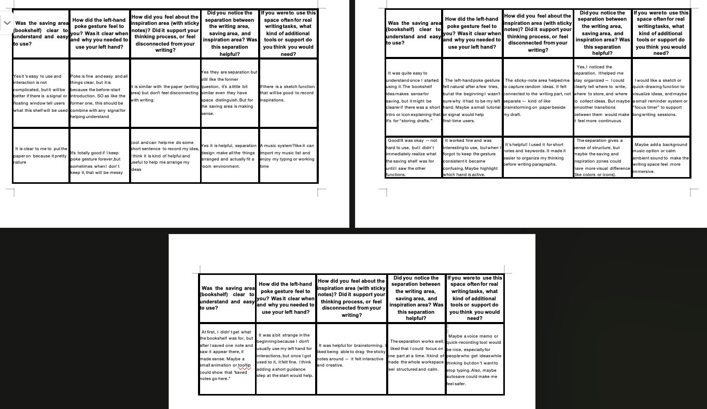

# Ruihan-Wu_DECO7230_2025

This Week's Focus
This week, we conducted user testing for Prototype 2 of the Inkroom project—a spatial document editor designed for immersive writing experiences in XR. The primary goal was to evaluate whether users could intuitively interact with the system using gesture-based inputs, understand the left–right hand role distribution, and perceive the spatial division of the working environment into three distinct zones: writing, saving, and inspiration.

We framed this round of testing around simulating a real writing task scenario. Participants were asked to edit a document, save it, and interact with an inspiration area via sticky notes. A key refinement from the previous version was enforcing the use of the left-hand poke gesture for keyboard interaction and mapping saving gestures to dragging the document to a bookshelf on the user’s right side—representing a familiar metaphor for document storage. Additionally, we provided a clearer visual cue system and spatial layout for different writing zones, tailoring this setup to better support postgraduate users’ cognitive workflows and need for flexible writing spaces.

Key Activities

Developed a full testing plan, including observational checklists and post-test short interviews.

Conducted hands-on testing using Meta Quest 3 with hand tracking (no controllers), in a Unity-developed simulation.

Collected qualitative feedback via six key open-ended questions focused on gesture clarity, spatial zone awareness, and feature usability.

Created a research-informed sticky-note zone for ideation support based on extended workspace concepts.

Logged errors, hesitation, and completion success to evaluate interaction fluency.

Reflections
This round of testing helped validate our assumption that postgraduates need more structured yet flexible zones for writing—especially to separate mental contexts (drafting, storing, reflecting). Users generally understood the drag-to-save gesture once primed, though a few expressed uncertainty about whether an action was registered—highlighting the importance of feedback cues.

Interestingly, the left-hand poke gesture was perceived as intuitive by most, especially when paired with visible transitions in keyboard state. Participants also appreciated the metaphor of a bookshelf as a saving area, but some wanted clearer indicators that saving had occurred—perhaps through a haptic pulse or color change.

One of the most valuable insights came from the inspiration zone interaction: while users liked the presence of sticky notes, some saw them as detached from the writing flow. Future versions could explore tighter integration, such as dragging notes into documents or tagging them.

This week's process reinforced the importance of spatial metaphors and gesture consistency in XR authoring tools. It also emphasized the need for clear, redundant feedback mechanisms to support cognitive ease, especially in low-visibility virtual environments. As next steps, I aim to iterate on visual and audio feedback design and further explore trajectory coherence (Benford et al., 2009) to make transitions between zones feel more natural and seamless.

Objective and validation metrics
In this round of evaluation, I aimed to validate whether users could clearly distinguish the roles and spatial logic of the three core zones in the Inkroom prototype: the writing zone, the saving zone, and the inspiration zone. I particularly focused on how users interpreted the bookshelf area as a metaphor for saving, and whether the sticky note wall supported idea generation without interfering with task focus. Additionally, I evaluated the improved gesture interactions—especially the left-hand poke gesture used to toggle input state—to understand their learnability and comfort.

Results & Analysis
Testing Plan Summary
In this round of evaluation, I conducted an updated prototype test focusing on hand gesture interaction and writing area optimization in the virtual environment. The testing took place using a MacBook connected to Meta Quest 3 and was operated within Unity, with hand tracking enabled and no controllers involved. The core interaction followed the previous workflow (left-hand poke to open the keyboard, right-hand writing, save to the right), but with new adjustments: I added a clearly defined saving zone represented by a bookshelf and introduced a new inspiration area with sticky notes. I also emphasized that the left hand should always remain in the poke posture to maintain input mode, which was clearly communicated to the participants before starting the task.
Testing participants were encouraged to independently complete the process of activating the keyboard, inputting text, closing the keyboard, and saving the document. The environment was structured into three distinct zones: the writing area, the saving area, and the inspiration area, aiming to simulate the real cognitive needs of postgraduate writing workflows. I observed their behavior, recorded the full session, and collected feedback through a short post-task interview.

Feedback Analysis
From the user tests, I observed that participants were generally able to complete the key operations independently after a brief instruction. Most users understood the “poke with left hand to trigger input” interaction, and appreciated that the system clearly separated the editing and saving stages. When dragging the paper toward the bookshelf, users often responded positively, saying it “felt like putting something back on a shelf” or “felt finished”. However, a few participants hesitated slightly when first encountering the saving gesture, indicating that while the metaphor worked, more visual cues could improve confidence.

For the inspiration zone, most participants liked the idea of having sticky notes as a semi-peripheral tool, stating it gave them space to “jot down messy thoughts”. Yet, some feedback mentioned that the distance between the main editing area and the sticky wall could be shortened slightly to reduce arm fatigue. As for feedback clarity, one user pointed out that after triggering input mode, it wasn’t immediately obvious that typing was activated, suggesting a more visible cursor or sound cue could help.

Evaluation of Aims-Testing Process & Reflection
This testing session provided valuable insights into the spatial cognition and metaphor recognition of my interface. While the prototype generally succeeded in separating functional areas and supporting writing flows, I realized that subtle gestures (like left-hand poke) still required a bit more onboarding. I also learned that even when metaphors are conceptually strong, without visual anchoring (such as ambient animation or zone shadows), they might not be immediately picked up by every user.

This iteration also taught me the importance of distance and effort in XR space design. The location of interactive elements influences not only comfort but also how users interpret functional intention. For instance, even though the sticky notes were intended to support ideation, if placed too far, they become isolated rather than integrated.

Concept Iteration-Next Iteration Plan
Based on this round of feedback, I will continue refining both interaction feedback and spatial arrangement. First, I will add highlighted boundary zones and animated indicators to clarify the function of each area (e.g., bookshelf glow on approach). Second, I will improve state feedback by adding a more visible cursor or subtle sound when the keyboard is activated. Finally, I will slightly adjust the physical arrangement—bringing the sticky notes closer and reducing the saving gesture range—to better support natural flow.

Statement of Originality & References
Figure：

Assets：
Desk、Whiteboard、Chair、Books ect。in environment：Bedroom / Interior - Low Poly assets -Unity assets
URL：https://assetstore.unity.com/packages/3d/props/interior/bedroom-interior-low-poly-assets-295074 
Plants in environment：Pandazole - Home interior low poly pack-Unity Assets
URL：https://assetstore.unity.com/packages/3d/props/interior/pandazole-home-interior-low-poly-pack-203033 
AI Tool Usage：
I declare that the work presented in this report is my own, except where due acknowledgment has been made. During the prototyping process, I consulted external resources including online tutorials, AI tools (ChatGPT by OpenAI and Claude by Anthropic), and peer discussions. Their contributions were limited to technical troubleshooting suggestions and idea exploration. The design decisions, prototype implementation, and final reflection remain my own responsibility.
OpenAI. (2025). ChatGPT [Large language model]. https://chat.openai.com/
Anthropic. (2025). Claude [Large language model]. https://claude.ai/ 
