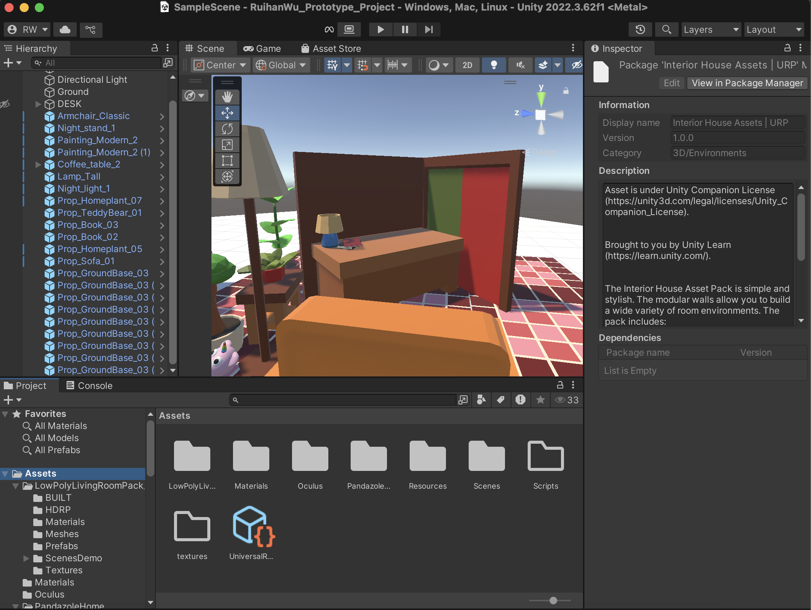

# Ruihan-Wu_DECO7230_2025

##Week3-Project Settings##15th_Aug_2025##

✨What I learned this week✨

This week, I focused on learning how to use simple scripting in Unity to enable basic interaction and movement. I practiced using WSAD keys to control a capsule character and understood how to apply Rigidbody components to allow for physics-based movement. I also explored how to implement proximity-based feedback, such as making objects glow when approached. These exercises helped reinforce my understanding of movement mechanics and interaction responses.

In addition, I started building the basic structure for Project 1, including placing major scene elements and adjusting the lighting to fit the mood. During our studio session, I also revisited how to apply Rigidbody and tag components properly, which supported my current prototyping work.

✨Reflection✨

At first, I struggled with setting up the Rigidbody correctly and forgot how to freeze rotations, but through repetition and class demonstrations, I regained confidence in using Unity’s physics and inspector tools. Setting up proximity-based interaction was new to me, but it helped me think more deeply about how users might naturally respond to visual feedback.

I also realized that even though the tasks were basic, they laid a solid foundation for the spatial and interaction logic I’ll need later in my project. The Studio session was especially helpful for debugging some earlier mistakes and clarified small setup details that make a big difference in overall experience.

✨Next steps✨

Next week, I plan to begin implementing more interaction-based triggers in my prototype—such as hover effects, environmental responses, or basic UI feedback. I also want to further develop the atmosphere by refining the lighting and audio settings. Additionally, I will continue placing interactive props in the scene and explore possible player-environment interaction mechanics for testing in the following phase.

**Screenshot of my progress:

Here is the my project building progress:

