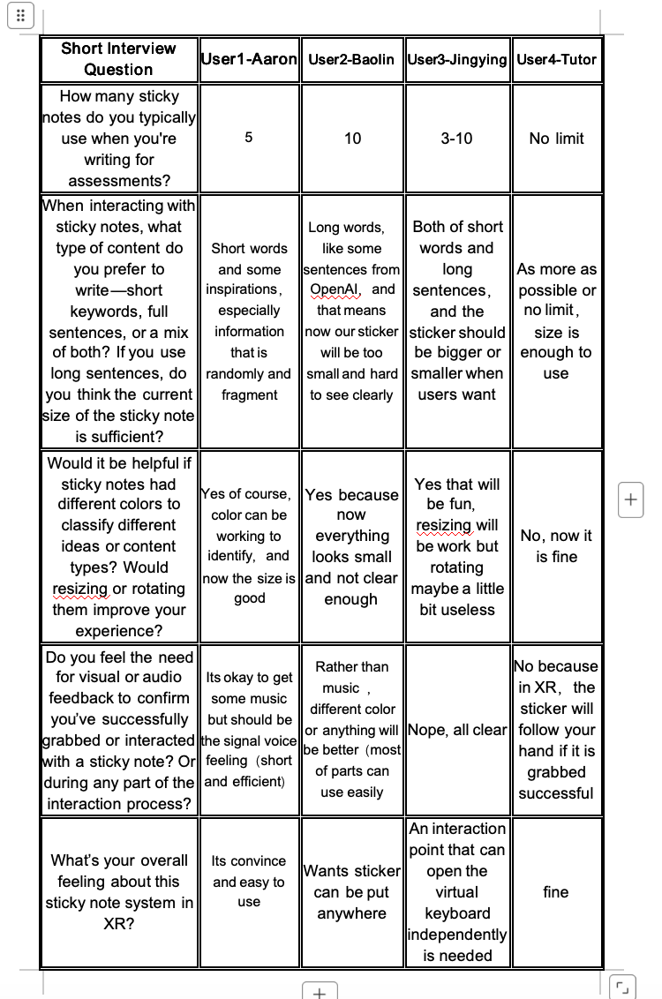
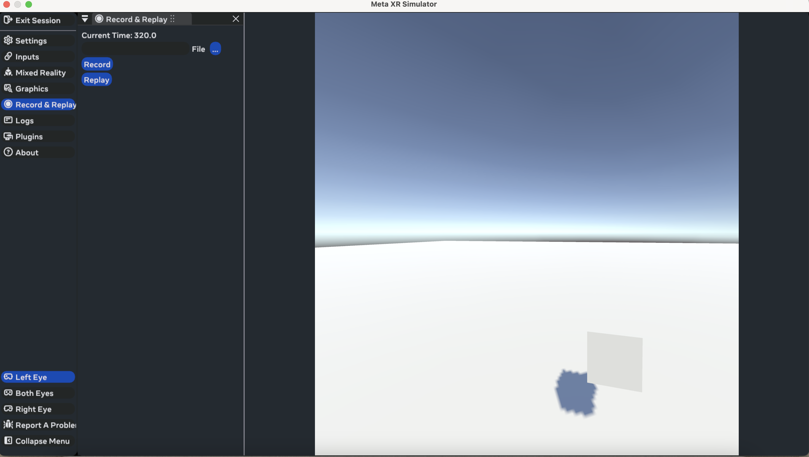

# Ruihan-Wu_DECO7230_2025

##Week5-Project Settings##28th_Aug_2025##

✨What I learned this week✨

This week, I finally learned how to install and run the XR Interaction Toolkit Simulator in Unity. With guidance from the tutorial and support from my tutor, I managed to follow the setup steps and understood how to test interactions even without wearing a real headset. In addition, I completed most of my Prototype 1, which focuses on creating a sticky note interaction system. I learned how to implement grabbable objects, show/hide virtual keyboards, and update text based on user input.

To achieve this, I actively explored Unity’s input system, wrote C# scripts for object behaviors, and referenced lots of YouTube tutorials. I also asked a friend for help when I got stuck, especially with script logic and prefab structure.

✨My Testing data collection-Summary of Key Feedback from XR Sticky Note Testing✨
During the testing of the prototype 1, I gathered valuable insights on how participants interacted with digital notes in immersive environments. Although the system encountered interaction bugs (e.g. simulator dragging issue), I were still able to observe meaningful reflections.

Like the first,the content size and expression needs:

Several participants found the current sticky note size too small, especially when writing longer sentences. Some preferred short words or fragments, while others mixed full ideas and quotes. This indicates that fixed-size notes may limit expressive freedom, and resizable sticky notes should be considered for future iterations.

Second,Visual Categorisation Through Colour
Most users agreed that color-coded notes would help organize thoughts or categories of content. This reflects a need for visual hierarchy and structure, which can support brainstorming or academic writing in spatial environments.

Third, Feedback for Interaction
Some participants suggested short sound or visual cues to confirm they had successfully grabbed or interacted with a note. Others felt current feedback was sufficient (e.g. sticker follows hand). This highlights the need for minimal but clear multimodal feedback to maintain smooth interactions without overwhelming users.

Interaction Fluidity And Overall Impressions
There was a strong desire to freely place sticky notes anywhere in the 3D space. One user also noted that the current method for opening the virtual keyboard felt unintuitive, and a more independent trigger (e.g. tapping on the note itself) might enhance control.

Most users found the system “easy to use” or “fine,” but also pointed out specific areas needing refinement—especially around freedom of expression and interaction efficiency. There is a clear demand for a more adaptive and user-responsive design.

✨Reflection✨

One key mistake I made this week was following an outdated tutorial that used Oculus XR Plugin instead of OpenXR, which caused my simulator to stop working. After spending hours trying to troubleshoot why the simulator wasn’t responding, I realised that the plugin choice actually affects whether the simulator is compatible. This mistake helped me better understand the differences between XR SDKs, and the importance of choosing the right base setup depending on testing needs.

Although it was frustrating to rebuild my scene after changing the SDK, I now feel much more confident about setting up XR environments from scratch. I also realised that learning through doing—trial and error, debugging, and video searching—is a very effective way for me to grow my technical confidence.

✨Next steps✨

Next week, I will focus on:
Testing whether my interaction flow (grab > type > place) works smoothly across different distances and user positions.

Preparing for user testing, including a short interview script and bug log.

Iterating on design improvements based on both technical usability and feedback from my peers.

I’ll also try to optimise how the sticky notes refresh after being used, so the user can always access a new one without needing to manually reset the scene.

**Screenshot of my progress:

Here is the my course study progress:

